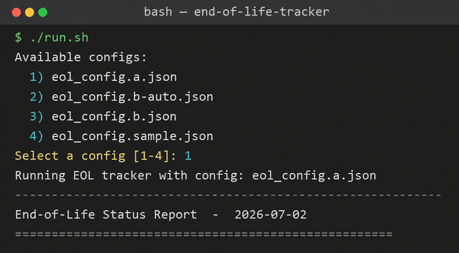
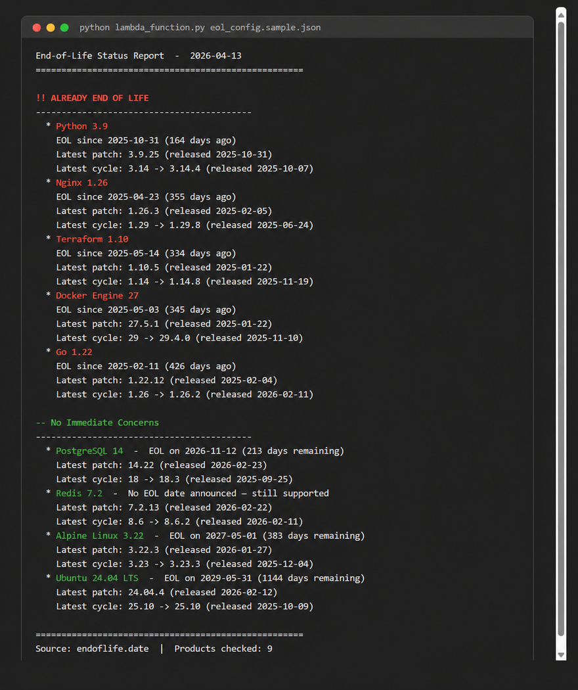
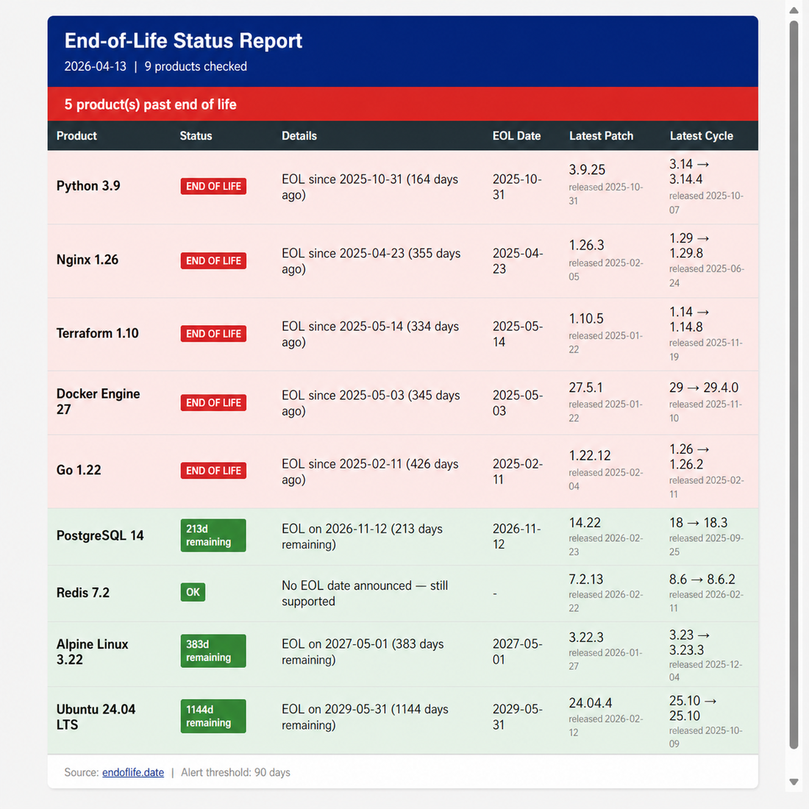

# EOL Tracker

A Python AWS Lambda that checks software end-of-life status from multiple data sources and sends alerts via email (SNS/SES), HTML report, or console output.

Track your stack — Spring Boot, Java, Nginx, Alpine, PostgreSQL, React, and [300+ more products](https://endoflife.date/) — and get notified before anything falls out of support. For AWS RDS / Aurora, the tracker can also scrape AWS's own release calendars for minor-version EOL dates that endoflife.date does not provide.

## Features

- **Pluggable data sources.** Each product picks its provider — endoflife.date for the broad catalog, or the AWS-docs scraper for RDS/Aurora minor-version EOL.
- Reports latest patch version and release date for each tracked product
- Shows latest available major/minor cycle so you know when a newer version exists
- Configurable alert thresholds (e.g. warn at 30, 60, 90 days before EOL)
- Multiple output channels: console, HTML file, SNS (plain text email), SES (HTML email)
- HTML reports include per-row source attribution and are written to `reports/<project>/<year>/<month>/<day>/` with a timestamp in the filename (e.g. `reports/a/2026/05/04/eol_report_a_2026-05-04_1132.html`)
- Product lists are stored in S3, one per project (`projects/<project>/eol_config.json`) — update what you track without redeploying the Lambda
- Runs on per-project EventBridge schedules (each project has its own configurable cron expression)
- AWS-docs scraper has built-in defenses against page changes: header-name validation, row-count sanity check, and a runtime canary that fails loudly if the page structure drifts

## Quick Start — Run Locally

**Prerequisites:** Python 3.9+

```bash
# 1. Clone the repo
git clone https://github.com/cheokjiade/end-of-life-tracker.git
cd end-of-life-tracker

# 2. Copy the sample config and edit it
cp eol_config.sample.json eol_config.json

# 3. Run it
python lambda_function.py eol_config.json
```

No AWS credentials or external dependencies are needed for local testing. The script reads from the local config file and outputs to the channels listed in `notifications` (defaults to console + HTML file).

### Helper scripts

Cross-platform wrappers pick the Python interpreter for you and let you choose which config to run. Use `run.sh` on macOS/Linux (or Git Bash / WSL) and `run.ps1` on native Windows PowerShell.

```bash
# macOS / Linux
./run.sh                      # interactive menu of available configs
./run.sh a                  # shorthand -> eol_config.a.json
./run.sh eol_config.a.json  # explicit file name (a path also works)
./run.sh --list               # list available configs and exit
```

```powershell
# Windows (PowerShell)
.\run.ps1                      # interactive menu of available configs
.\run.ps1 a                  # shorthand -> eol_config.a.json
.\run.ps1 eol_config.a.json  # explicit file name (a path also works)
.\run.ps1 -List                # list available configs and exit
```

Passing a bare name like `a` resolves to `eol_config.a.json`; with no argument you get a numbered menu of every `eol_config.*.json` file in the repo:



### Sample output

#### Console (plain text)



#### HTML report

The HTML report is generated alongside the console output if configured, written under `reports/<project>/<year>/<month>/<day>/` (where `<project>` is derived from the configured `path` base name — `eol_report_a.html` → `a`, plain `eol_report.html` → `default`). It uses colour-coded rows and status badges, and is also the format sent via SES email.



## Configuration

The config file controls everything. Locally it is read from the filesystem; in a deployment each project's copy lives in S3 at `projects/<project>/eol_config.json`.

### Products

Each entry has a `source` field selecting which data provider to use. If `source` is omitted it defaults to `endoflife_date` (so existing configs keep working unchanged).

#### Source: `endoflife_date` (default)

| Field | Description | Example |
|-------|-------------|---------|
| `source` | Optional — defaults to `endoflife_date` | `"endoflife_date"` |
| `product` | Product name as it appears in the endoflife.date API | `spring-boot` |
| `version` | Release cycle identifier (usually `major.minor`) | `4.0` |
| `label` | Display name in reports | `Spring Boot 4.0` |

**Finding product names and cycles:**

```bash
# List all available products
curl https://endoflife.date/api/all.json | python -m json.tool

# List all cycles for a product
curl https://endoflife.date/api/spring-boot.json | python -m json.tool
```

Or browse [endoflife.date](https://endoflife.date/) directly.

#### Source: `aws_rds_scrape`

For RDS / Aurora PostgreSQL, endoflife.date only tracks the major version EOL (e.g. `17 → 2030-02-28`). AWS, however, also deprecates *minor* versions on a much shorter timeline (e.g. `17.5 → September 2026` for plain RDS, `17.5 → December 2026` for Aurora). This source scrapes AWS's release-calendar pages to surface those minor-version dates.

| Field | Description | Example |
|-------|-------------|---------|
| `source` | `"aws_rds_scrape"` | `"aws_rds_scrape"` |
| `engine` | `"aurora-postgresql"` or `"rds-postgresql"` | `"aurora-postgresql"` |
| `version` | Minor version (`major.minor`) | `17.5` |
| `label` | Display name in reports | `AWS RDS Aurora PostgreSQL 17.5` |

```json
{
  "source": "aws_rds_scrape",
  "engine": "aurora-postgresql",
  "version": "17.5",
  "label": "AWS RDS Aurora PostgreSQL 17.5"
}
```

The scraper validates the page structure on every run. If AWS renames a column, removes the table, or changes the layout, every entry from this source is marked as `error` in the report — you get a loud alert via your existing notification channels rather than silently wrong dates.

### Alert thresholds

```json
"alert_thresholds_days": [30, 60, 90]
```

Products within the **largest** threshold (90 days) of their EOL date are flagged as "approaching end of life". Products past their EOL date are flagged as "already end of life". At-risk lifecycle phases that publish **no date** (for example an AWS SDK in *Maintenance*) are always treated as approaching — they cannot be thresholded away.

Results the tracker could not verify are reported separately as **tracker health** failures: `error` (the check itself failed) and `unknown` (present but unverifiable, e.g. a version missing from npm/Maven Central). They never render as healthy and trigger notifications even under `alerts_only`, with a distinct `[TRACKER HEALTH]` subject/banner. Products deliberately marked `untracked` stay informational.

### Notification frequency

```json
"notify_when": "always"
```

| Value | Behaviour |
|-------|-----------|
| `always` | Send a report every run, even if nothing needs attention |
| `alerts_only` | Send when something needs attention: a product is EOL/approaching (including undated at-risk phases), or any product reports an `error`/`unknown` tracker-health failure |

### Notification channels

```json
"notifications": [
  {"type": "console"},
  {"type": "html_file", "path": "eol_report.html"},
  {"type": "sns", "topic_arn": "arn:aws:sns:eu-west-1:123456789:eol-alerts"},
  {"type": "ses", "from_email": "noreply@example.com", "to_emails": ["team@example.com"]}
]
```

| Type | Format | Notes |
|------|--------|-------|
| `console` | Plain text to stdout | No config needed |
| `html_file` | HTML file | `path` defaults to `eol_report.html`; the file is written under `reports/<project>/<year>/<month>/<day>/` (`<project>` derived from the `path` base name). **Lambda deployments:** this channel is local-only by default — inside Lambda a relative path (or any absolute path outside `/tmp`) skips with a warning instead of failing. To write in Lambda, set `path` to an explicit absolute destination under `/tmp` (e.g. `/tmp/reports/eol_report.html`); note `/tmp` is ephemeral scratch space — use S3 for durable AWS-hosted reports |
| `sns` | Plain text email via SNS | `topic_arn` or `SNS_TOPIC_ARN` env var |
| `ses` | HTML email via SES | `from_email`/`to_emails` or `SES_FROM_EMAIL`/`SES_TO_EMAILS` env vars. Sender must be [verified in SES](https://docs.aws.amazon.com/ses/latest/dg/creating-identities.html) |

You can enable multiple channels simultaneously.

SNS and SES are **required delivery channels by default**; console and
`html_file` are optional by default. Set a boolean `"required": true` or
`false` on any channel to override that default. A successful optional console
or file delivery never masks failure of every required durable route.

### Delivery outcomes and failure handling

Every channel invocation produces an outcome record — returned in the Lambda
response as `notification_outcomes`, logged per run, and printed by local runs:

- `delivered` — the channel confirmed the send/write.
- `skipped` — never attempted: unknown channel type, missing routing config
  (no topic ARN / no sender or recipients), or html_file not writable in Lambda.
- `failed` (error) — attempted but the delivery raised.

Outcome records also identify whether the channel was `required`; a delivered
`html_file` outcome includes its local output path.

Behaviour on failure:

1. Channels are attempted in configuration order; one failing channel never
   prevents a later independent channel from being attempted. Delivery succeeds
   when at least one required channel delivers (or when no channel is required).
2. The handler's `notified` response field reflects **actual delivery** — it is
   true only when at least one configured channel delivered, not merely that a
   notification was attempted. A run suppressed by `alerts_only` also reports
   `notified: false`.
3. If required channels exist and **every required channel** ends up
   undelivered, the handler raises a failure while running on AWS Lambda. This
   makes the invocation fail so
   Lambda's asynchronous retry policy engages, and after all retries the event
   lands in the function's dead-letter queue (`<project>-lambda-failures`). Two
   CloudWatch alarms (`<project>-function-errors`,
   `<project>-failure-dlq-not-empty`) page the ops topic configured via
   `ops_notification_email`. Local runs never raise — they print the per-channel
   outcomes instead.

Logs never contain recipient addresses: SES messages log a recipient count
only, and outcome details describe routing qualitatively rather than naming
destinations.

## Deploy to AWS Lambda

### Prerequisites

- [Terraform](https://www.terraform.io/downloads) >= 1.3.0
- AWS CLI configured with appropriate credentials
- An email address per project to receive that project's SNS alerts

### Steps

```bash
# 0. Build the Lambda artifact from the runtime allowlist
python build_lambda_package.py build

cd terraform

# 1. Create your variables file
cp terraform.tfvars.example terraform.tfvars
# Edit terraform.tfvars — set your bucket name and the projects map
# (one entry per project: its config_path, notification email, schedule)

# 2. Lint every project config you are about to distribute (network-free)
python ../lambda_function.py --validate ../eol_config.a.json

# 3. Deploy
terraform init
terraform apply
```

The ZIP contains only `lambda_function.py` and the `eoltracker/` package.
Terraform fails plan/apply unless that artifact is byte-for-byte current, so
rerun step 0 after any change under `eoltracker/`. See
[docs/packaging.md](docs/packaging.md) for how packaging and verification work.

After deployment:
- **Confirm every SNS subscription** — AWS emails each project's `notification_email` a confirmation link; that topic stays silent until it is clicked.
- Each project gets its own EventBridge rule running on its `schedule_expression` (default: daily at 8:00 AM UTC).
- Terraform uploads each project's `config_path` file to `projects/<project>/eol_config.json` in the config bucket — one object per project. There is no root-level `eol_config.json` object and no global `CONFIG_KEY`.
- Useful outputs for operating the deployment: `lambda_function_name`,
  `config_bucket`, `config_file_keys` (project → exact S3 key),
  `config_object_version_ids`, `sns_topic_arns`, and `schedule_rule_names`.
- Config objects are **versioned**. See `terraform/README.md` for the provider
  lockfile workflow and the point-in-time rollback runbook.

### Updating tracked products

Product lists are updated in place in S3 — no redeployment needed. Each project has exactly one config object whose key is `projects/<project>/eol_config.json`; the authoritative map of project → key comes from the `config_file_keys` Terraform output (run from `terraform/`). Always operate on the exact key for the project you want:

```bash
# Discover the per-project keys
terraform output -json config_file_keys

# Download the current config for one project
aws s3 cp s3://<config-bucket>/projects/<project>/eol_config.json \
  eol_config.<project>.local.json

# Edit eol_config.<project>.local.json ...

# Validate before uploading — malformed structure aborts that project's next run
python lambda_function.py --validate eol_config.<project>.local.json

# Optional smoke run against live data sources
python lambda_function.py eol_config.<project>.local.json

# Upload back to the project's exact key
aws s3 cp eol_config.<project>.local.json \
  s3://<config-bucket>/projects/<project>/eol_config.json
```

Verify the upload took effect with a [manual invocation](#manual-invocation) carrying the same `config_key`.

Two caveats:

- A later `terraform apply` re-uploads each project's local `config_path` file (Terraform compares a content hash against the live object), so manual edits made via console or CLI will be overwritten. Treat the repository file as the source of truth.
- Bucket versioning is enabled and Terraform exposes each last-applied object
  version. Follow `terraform/README.md` to validate and promote an older version
  without deleting history.

#### Recovering a broken config

If an upload turns out to be wrong, follow the point-in-time S3 rollback runbook
in `terraform/README.md`. A downloaded known-good copy can also be uploaded to
the same project key, creating another recoverable current version:

```bash
aws s3 cp <known-good-copy>.json \
  s3://<config-bucket>/projects/<project>/eol_config.json
```

Or update it via the S3 console — navigate to `projects/<project>/eol_config.json`, not to a root-level `eol_config.json`.

### Terraform variables

Top-level variables (`terraform/variables.tf`):

| Variable | Required | Default | Description |
|----------|----------|---------|-------------|
| `projects` | Yes | - | Map of project name → per-project settings (see next table) |
| `config_bucket_name` | Yes | - | S3 bucket name for the config files (globally unique) |
| `project_name` | No | `eol-checker` | Prefix for shared resources: Lambda function name, IAM role, log group |
| `aws_region` | No | `eu-west-1` | AWS region |
| `lambda_timeout` | No | `60` | Lambda timeout in seconds |
| `lambda_memory` | No | `128` | Lambda memory in MB |
| `eol_max_workers` | No | `4` | Maximum concurrent provider checks |
| `eol_time_reserve_ms` | No | `15000` | Milliseconds reserved for rendering and delivery |
| `eol_check_start_guard_ms` | No | `18000` | Additional time required before starting a provider check |
| `ses_from_email` | No | `""` | Verified SES sender shared across all projects; empty disables SES |
| `ops_notification_email` | No | `""` | Email subscribed to Lambda failure and dead-letter queue alarms; empty creates the ops topic without a subscription |

Per-project settings — one entry per project under `projects`:

| Field | Required | Default | Description |
|-------|----------|---------|-------------|
| `config_path` | Yes | - | Local config file path relative to repo root; uploaded to `projects/<project>/eol_config.json` |
| `notification_email` | Yes | - | Email that receives the subscription confirmation for this project's SNS topic |
| `schedule_expression` | No | `cron(0 8 * * ? *)` | Daily 8:00 AM UTC by default |
| `ses_to_emails` | No | `""` | Comma-separated SES recipients delivered via the schedule's event payload |

### Environment variables (set by Terraform)

Terraform sets shared environment variables on the function; there are no
per-project environment variables:

| Variable | Purpose |
|----------|---------|
| `CONFIG_BUCKET` | S3 bucket containing every project's config file |
| `SES_FROM_EMAIL` | Fallback SES sender (may be empty; the notification config wins) |
| `EOL_MAX_WORKERS` | Concurrent provider checks (default `4`) |
| `EOL_TIME_RESERVE_MS` | Time kept for rendering and delivery (default `15000`) |
| `EOL_CHECK_START_GUARD_MS` | Extra time required before starting a check (default `18000`) |

In particular, Terraform sets **no** `CONFIG_KEY`, `SNS_TOPIC_ARN`, or `SES_TO_EMAILS`. Per-project routing instead arrives in each EventBridge rule's input payload (`project`, `config_key`, `sns_topic_arn`, `ses_to_emails`) — see `aws_cloudwatch_event_target.lambda` in `terraform/main.tf` and `lambda_handler` in `eoltracker/handler.py`.

When a value is absent from both the event and the config entry, the handler falls back to env vars and, for the config key only, to a hard-coded default:

| Value | Resolution order |
|-------|------------------|
| Config key | event `config_key` → `CONFIG_KEY` env var → built-in default `eol_config.a.json` |
| SNS topic ARN | config entry `topic_arn` → event `sns_topic_arn` → `SNS_TOPIC_ARN` env var |
| SES sender / recipients | config entry `from_email` / `to_emails` → event overrides → `SES_FROM_EMAIL` / `SES_TO_EMAILS` env vars |

Under the default Terraform layout `CONFIG_KEY`, `SNS_TOPIC_ARN`, and
`SES_TO_EMAILS` remain unset, so scheduled runs use the exact values carried by
their per-project event payloads. `SES_FROM_EMAIL` is the one optional shared
routing fallback Terraform may populate.

### Provider execution budget

Provider checks use bounded concurrency and retain config-file order in the
report. Work is submitted lazily and stops when the remaining Lambda time is
less than the reporting reserve plus the provider start guard. A check that
cannot finish safely becomes an `error` row, so `alerts_only` reports degraded
tracker health instead of allowing the invocation to time out silently.

The Terraform controls are `eol_max_workers`, `eol_time_reserve_ms`, and
`eol_check_start_guard_ms`. Keep the start guard at least 15000 ms, the longest
socket timeout used by a built-in provider. Increase the Lambda timeout or
lower concurrency if CloudWatch shows repeated partial runs; do not consume
the reporting reserve to squeeze in more lookups.

### Manual invocation

To trigger a run outside its schedule, invoke the shared function with the same per-project values the EventBridge rule itself would pass. Start from the Terraform outputs (run from `terraform/`):

```bash
terraform output -raw lambda_function_name    # shared function name
terraform output -json config_file_keys       # project -> S3 key
terraform output -json sns_topic_arns         # project -> topic ARN
```

Create an `event.json` matching the schedule's target shape:

```json
{
  "project": "<project>",
  "config_key": "projects/<project>/eol_config.json",
  "sns_topic_arn": "<per-project-sns-topic-arn>",
  "ses_to_emails": ""
}
```

- `config_key` must be the exact `projects/<project>/eol_config.json` value from `config_file_keys` — it is never inferred.
- An empty string behaves like an absent value, so `"ses_to_emails": ""` simply defers to whatever SES settings the config carries; use it when you do not want an event-level override.

Invoke and print the response:

```bash
FUNCTION=$(terraform output -raw lambda_function_name)

# Preferred — fileb:// always sends the file's raw bytes
aws lambda invoke \
  --function-name "$FUNCTION" \
  --payload fileb://event.json \
  response.json && cat response.json

# Inline equivalent — AWS CLI v2 needs the binary-format flag here
aws lambda invoke \
  --function-name "$FUNCTION" \
  --cli-binary-format raw-in-base64-out \
  --payload '{"project":"<project>","config_key":"projects/<project>/eol_config.json"}' \
  response.json && cat response.json
```

AWS CLI v2 treats an inline `--payload` string as base64-encoded binary unless
`--cli-binary-format raw-in-base64-out` is supplied. `fileb://` bypasses that
setting and sends the JSON file's raw bytes.

A successful invocation returns a JSON object in `response.json` with `"statusCode": 200`, your `"project"` name, and counts of checked products and alerts. On failure, inspect the `/aws/lambda/<function-name>` CloudWatch Logs log group.

**Do not invoke with `--payload '{}'`.** Terraform sets no `CONFIG_KEY`, so the handler falls back to its built-in default key `eol_config.a.json` (`eoltracker/handler.py`) — that object does not exist under the `projects/<project>/eol_config.json` layout, so the invocation fails with `NoSuchKey` while scheduled runs continue using their own event payloads.

## Architecture

```
EventBridge schedule rules (one per project, cron-driven)
        |  input payload: {project, config_key,
        |                  sns_topic_arn, ses_to_emails}
        v
  Shared AWS Lambda (Python 3.12)
        |
        +-- loads config: s3://<config-bucket>/<config_key>
        |     (= projects/<project>/eol_config.json)
        +-- dispatches each product entry by its "source" to a provider:
        |     +-- endoflife_date -> https://endoflife.date/api/{product}.json
        |     +-- aws_rds_scrape -> docs.aws.amazon.com release calendars
        |     +-- ... other registry sources (see eoltracker/parsers/)
        +-- categorises: EOL / Approaching / OK
        |
        +---> this project's SNS topic (plain-text email)
        +---> SES (HTML email)
        +---> HTML file (dated reports/ tree locally; explicit /tmp path in Lambda)
        +---> Console (CloudWatch Logs)
```

Environment variables carry only shared settings (`CONFIG_BUCKET`, `SES_FROM_EMAIL`); everything per-project travels in the event payload.

### Adding a new data source

Each provider is its own file under `eoltracker/parsers/` — drop one in and it is
auto-registered at import time (no registry to edit):

```python
# eoltracker/parsers/my_source.py
from ..core import _error_result, logger

def _provider_my_source(entry, today):
    # ... fetch + transform ...
    return {"label": ..., "status": "ok|approaching|eol|error|unknown",
            "message": ..., "eol_date": ..., "source": "my_source", ...}

SOURCE = "my_source"          # entry["source"] value that routes here
LABEL  = "My source"          # human label shown in reports
provider = _provider_my_source
def url_for(r):               # optional — clickable upstream link
    return "https://example.com/my_source"
```

Once the file exists, any product entry with `"source": "my_source"` is routed to it. The normalized result dict is consumed by the existing categorizer and report formatters — no other changes needed. See `docs/adding-a-provider.md` for the full how-to.

## Data sources

| Source | Coverage | Auth | Granularity |
|--------|----------|------|-------------|
| [endoflife.date](https://endoflife.date) | 450+ products (community-maintained, open-source) | None | Major/cycle |
| AWS docs release calendars | RDS / Aurora PostgreSQL minor versions | None (public HTML pages) | Minor version |

## License

MIT
